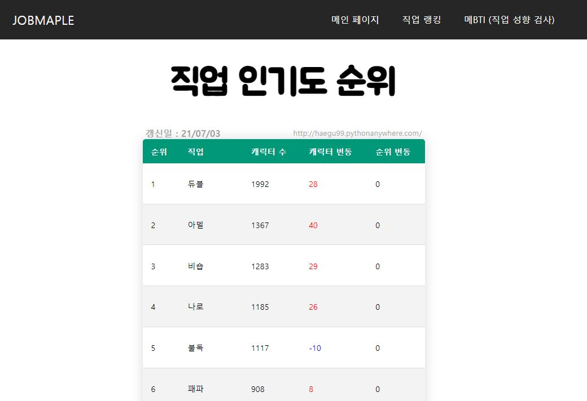
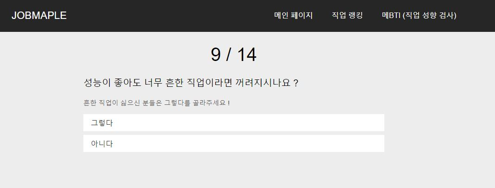
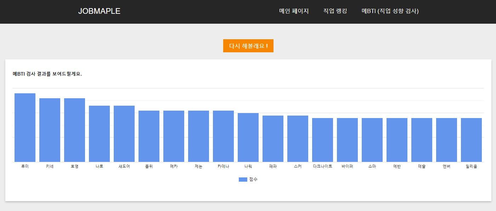

# Maple_web    
### 본 서비스는 온라인 게임 '메이플스토리' 의 데이터를 기반으로 제공됩니다.    

## Summary

1. 소개
    - 개발 배경
    - Maple_web 이란?
2. 개발
    - Maple Rank Page (크롤링을 이용하여 캐릭터의 인기도를 분석 및 제공)
    - Maple MBTI Page (성향 분석으로 사용자 취향에 맞는 직업 추천)
3. 사용자 반응 및 통계
    - 통계
    - 사용자 반응과 그에 대한 피드백
4. 마무리

## 소개
Maple_web은 온라인 게임 '메이플스토리' 에 대한 데이터를 기반으로,     
크게 게임에 존재하는 직업에 대한 인기도를 측정하여 제공하는 서비스와     
유저 성향 분석으로 직업을 추천해주는 서비스로 나눌 수 있습니다.

### 개발배경
메이플스토리 유튜버의 관련한 영상들을 보던 중, '직업 추천'에 관련한 영상의 조회수가 타 영상의 조회수보다 높다는 것을 알 수 있었습니다.     
해당 게임은 MMORPG 장르로서, 한번 직업을 정하면 타 직업으로 이동하기가 매우 제한적이며, 소모되는 시간과 재화가 많은 유저들에게 부담스럽게 작용 있습니다. 때문에 해당 서비스에 대한 필요성을 느꼈고, 게임을 시작하는 단계에 유저들이 자신의 취향에 맞는 직업을 보다 쉽게 찾고, 즐겁게 게임에 정착 할 수 있었으면 좋겠다는 생각에서 해당 서비스 개발을 시작하게 되었습니다.

### Maple_web 이란?
해당 서비스는 크게 2가지로 나눌 수 있습니다.    

1. Maple Rank Page

메이플스토리 공식 랭킹 페이지를 크롤링하여, 260 캐릭터 이상의 캐릭터 수를 집계하여 제공합니다.    
상대적으로 성능이 좋은 직업 일수록 소위 '고레벨'에 많이 분포되어 있을 것이라는 아이디어를 바탕으로 시작하였습니다.    
또한 해당 게임은 인기가 있고, 유저들의 커뮤니티 입김이 강한 직업군이 받는 혜택이 많은 편이라고 생각되기 때문에 도움이 되는 정보라고 생각되었습니다.

2. Maple MBTI Page

## 개발
